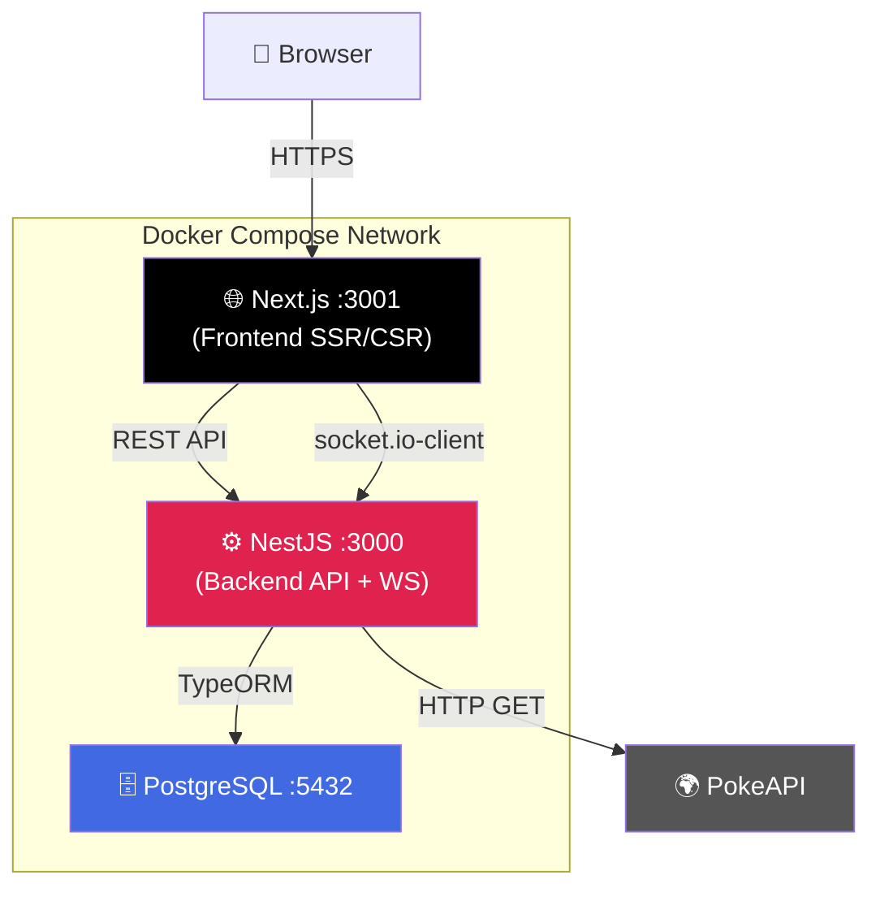

<div align="center">

# 🔐 Prueba Técnica Full-Stack
## NestJS · Next.js · WebSocket · Docker


</div>

---

## 📌 Descripción

Bienvenido a la prueba técnica para el rol de **Consultor de Tecnología Full-Stack**. Este repositorio contiene una base de código moderna pero **funcionalmente incompleta**, diseñada para evaluar tus habilidades en arquitectura, desarrollo backend/frontend, comunicación en tiempo real y seguridad.

Tu misión es **completar la implementación** de una aplicación que gestiona autenticación de usuarios y visualización de sprites Pokémon en tiempo real via WebSocket.

> No buscamos solo "que funcione". Buscamos **código limpio, tipado fuerte y seguro**.

---

## 📚 Índice de Documentos

| Documento | Descripción | Audiencia |
|---|---|---|
| 📋 [`TECHNICAL_ASSESSMENT.md`](./TECHNICAL_ASSESSMENT.md) | Instrucciones completas, historias de usuario y criterios de aceptación | Candidato |
| 🔒 [`OWASP_REQUIREMENTS.md`](./OWASP_REQUIREMENTS.md) | Requisitos de seguridad obligatorios (25% de la nota) | Candidato |
| 📝 [`SOLUTION_TEMPLATE.md`](./SOLUTION_TEMPLATE.md) | Template obligatorio de entrega | Candidato |
| 📊 [`EVALUATION_CRITERIA.md`](./EVALUATION_CRITERIA.md) | Rúbrica detallada de puntuación | Evaluador |

---


### 🤖 Política de Uso de IA

Se permite el uso asistido de **Claude Code**, **Gemini** (navegador) o **Google Antigravity / Claude Sonnet**.  
El uso de otras herramientas (GitHub Copilot, ChatGPT, etc.) **no está permitido**.  
Documenta tu uso en `SOLUTION_TEMPLATE.md` — sección obligatoria si usaste IA.

## 🛠️ Stack Tecnológico

| Capa | Tecnología | Versión |
|---|---|---|
| **Backend** | NestJS + TypeORM + class-validator | ^10.x |
| **Frontend** | Next.js + React Hook Form + Zod | ^14.x |
| **Estado** | Zustand | ^4.x |
| **Estilos** | TailwindCSS | ^3.x |
| **Base de Datos** | PostgreSQL | 17-alpine |
| **Tiempo Real** | Socket.IO | ^4.x |
| **Infraestructura** | Docker + Docker Compose | ^24.x |
| **Autenticación** | JWT (@nestjs/jwt) | — |

---

## ✅ Prerrequisitos

| Herramienta | Versión mínima | Link |
|---|---|---|
| Docker Desktop / Engine | 24.0+ | [docs.docker.com](https://docs.docker.com/get-docker/) |
| Docker Compose | 2.20+ | Incluido con Docker Desktop |
| Git | 2.40+ | [git-scm.com](https://git-scm.com/) |
| Node.js *(opcional, lint local)* | 20 LTS | [nodejs.org](https://nodejs.org/) |

---

## 🏗️ Arquitectura del Sistema



---

## 🚀 Setup Step-by-Step

### 1. Configurar entorno
```bash
cp .env.example .env
# Editar .env — obligatorio cambiar JWT_SECRET
```

### 2. Modo Desarrollo (Hot-Reload)
```bash
docker-compose -f docker-compose.dev.yml up --build
```

Salida esperada:
```
backend_1   | [NestApplication] Nest application successfully started
frontend_1  | ▲ Next.js ready on http://localhost:3001
```

### 3. Ejecutar tests
```bash
docker-compose -f docker-compose.dev.yml exec backend npm test
```

### 4. Entorno de evaluación final
```bash
docker-compose -f docker-compose.test.yml up --build
```

---

## 🌐 URLs de Acceso

| Servicio | URL | Descripción |
|---|---|---|
| 🎨 Next.js Frontend | http://localhost:3001 | Aplicación web |
| ⚙️ NestJS API | http://localhost:3000 | REST API |
| 📖 Swagger Docs | http://localhost:3000/api/docs | Documentación interactiva |
| 🗄️ PostgreSQL | localhost:5432 | Base de datos |
| 🌐 App (prod) | http://localhost:80 | Solo con `docker-compose.test.yml` |

---

## 📁 Estructura del Proyecto

```
daka-technical-assessment-nest-next/
│
├── backend/
│   ├── src/
│   │   ├── auth/                   # ⚠️ TODO: AuthService (login, register, JWT)
│   │   │   ├── auth.service.spec.ts # ← Seed tests (deben pasar)
│   │   │   └── jwt.strategy.ts
│   │   ├── pokemon/                # ⚠️ TODO: PokemonGateway + PokeAPI
│   │   └── config/
│   └── Dockerfile
│
├── frontend/
│   ├── src/app/
│   │   ├── (auth)/
│   │   │   ├── login/              # ⚠️ TODO: React Hook Form + Zod
│   │   │   └── register/           # ⚠️ TODO: validación schema
│   │   └── dashboard/              # ⚠️ TODO: WebSocket + Zustand
│   └── Dockerfile
│
├── docker-compose.dev.yml          # ⚠️ TODO: Completar configuración
├── docker-compose.test.yml
├── .env.example
└── [documentos de evaluación]
```

---

## 🧪 Resumen de Tareas

| # | Área | Tarea | Peso |
|---|---|---|---|
| 1 | Backend — Auth | `AuthService`: register, login, bcrypt, JWT | Alto |
| 2 | Backend — Pokémon | Integración PokeAPI + manejo de errores | Alto |
| 3 | Backend — WebSocket | `PokemonGateway` para sprites en tiempo real | Alto |
| 4 | Frontend — Auth | Login/Register con React Hook Form + Zod | Medio |
| 5 | Frontend — Dashboard | WebSocket consumer + Zustand state | Medio |
| 6 | Docker | Completar `docker-compose.dev.yml` | Medio |
| 7 | Seguridad | Implementar OWASP requirements | Alto |
| 8 | Tests | Seed tests en `auth.service.spec.ts` | Obligatorio |

---

## 📦 Checklist de Entrega

- [ ] `docker-compose.test.yml up --build` sin errores
- [ ] Swagger muestra todos los endpoints implementados
- [ ] Seed tests pasan: `exec backend npm test`
- [ ] Sin `console.log` debug ni stack traces en respuestas
- [ ] `SOLUTION_TEMPLATE.md` completado
- [ ] Variables sensibles solo en `.env`

---

## 🔧 Troubleshooting

| Problema | Solución |
|---|---|
| `Port 3001 already in use` | `lsof -ti:3001 \| xargs kill` |
| `TypeORM connection refused` | `docker-compose -f docker-compose.dev.yml logs db` |
| `Module not found` en Next.js | `down -v && up --build` |
| `WebSocket CORS error` | Verificar `cors: { origin: 'http://localhost:3001' }` en el Gateway |

---

<div align="center">

**¡Mucho éxito! Demuestra tu potencial.** 🚀

*Daka Technology Team — Proceso de Selección Técnica*

</div>
